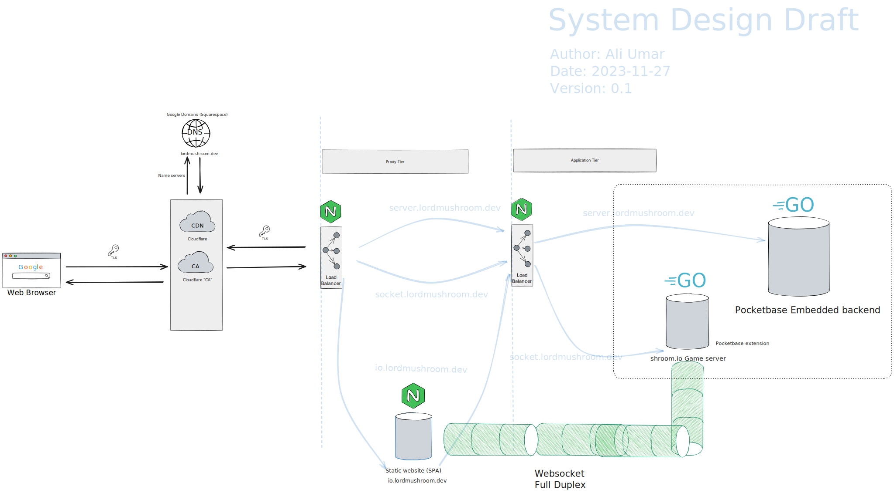

# shroom.io
## Description
Mushroom themed io game. You'll be able to pick from a 25+ different types of mushrooms to play as. There will be a scoring system. In order to play the game you must login and have an account associated with your character. You will also be able to send a message every so often as you flow along mushroom space, meeting other shroomies.

## Project link
https://io.lordmushroom.dev **in-active**

## System design
Rough indication of what I want the plumbing to looking like

Pocketbase will be extended to be an authoratative game server over websocket protocol

## Project Setup 

#### Pre-requisites
- windows GCC / some GNU utils - https://jmeubank.github.io/tdm-gcc/
- go-lang - https://go.dev/
- http-server - https://www.npmjs.com/package/http

#### Steps

1. Install the above tools, I use windows (>()) 
2. You may have to add the above tools to your path (installers may take care of it for you, not sure)
3. To run the client
   
        make web

4. To run the server
   
        make server