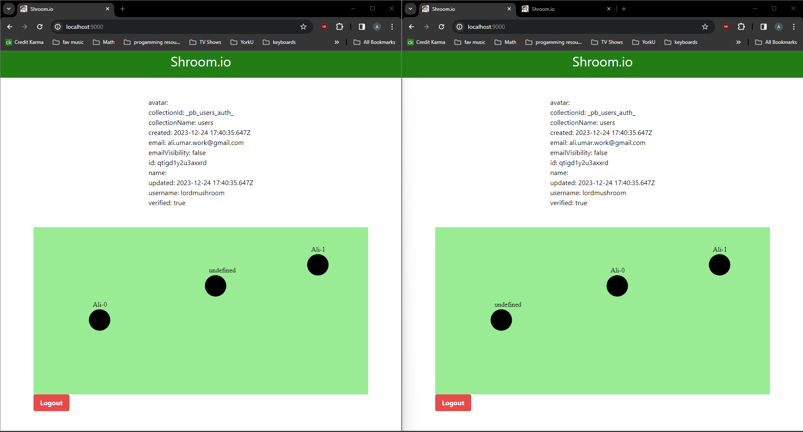

# shroom.io
## Description
Mushroom themed io game. You'll be able to pick from a 25+ different types of mushrooms to play as. There will be a scoring system. In order to play the game you must login and have an account associated with your character. You will also be able to send a message every so often as you flow along mushroom space, meeting other shroomies.

## Project link
https://io.lordmushroom.dev **in-active**


## System design
Rough indication of what I want the plumbing to looking like


Pocketbase will be extended to be an authoratative game server over websocket protocol

## Project Setup 

#### Pre-requisites
- windows GCC / some GNU utils - https://jmeubank.github.io/tdm-gcc/
- go-lang - https://go.dev/
- http-server - https://www.npmjs.com/package/http
- pocketbase-client_sdk (makes your life easy) - https://pocketbase.io/docs/client-side-sdks
- tailwind.css - https://tailwindcss.com/

#### Steps

1. Install the above tools, I use windows (>()) 
   - For tailwindcss, I used their standalone prebuilt binary and added it to my $PATH. Then I was able to use Make with it and configure tailwind preprocessor
        ```
            make tailwind 
        ```

2. You may have to add the above tools to your path (installers may take care of it for you, not sure)
3. Setup your directory structure as server/js/pocketbase_sdk/dist with the files in the pocketbase_sdk

   ```
    Folder PATH listing for volume OS
    Volume serial number is 00000277 7612:6FE7
    C:.
    ├───app
    │   ├───assets
    │   ├───js
    │   │   └───pocketbase_sdk
    │   │       └───dist
    │   └───styles
    ├───design
    └───server
        ├───pb_data
        │   └───backups
        ├───pkg
        │   ├───data_access
        │   └───websocket
        └───ssl
   ```
4. From pocketbase client sdk add to your index html page

    ```
        <script src="js/pocketbase_sdk/dist/pocketbase.umd.js"></script>
    ```

5. To run the client
   
        make web

6. To run the server
   
        make server

7. Use tailwind css pre-processor (defaults to --watch mode)
   
        make tailwind

## Realtime Multiplayer!

